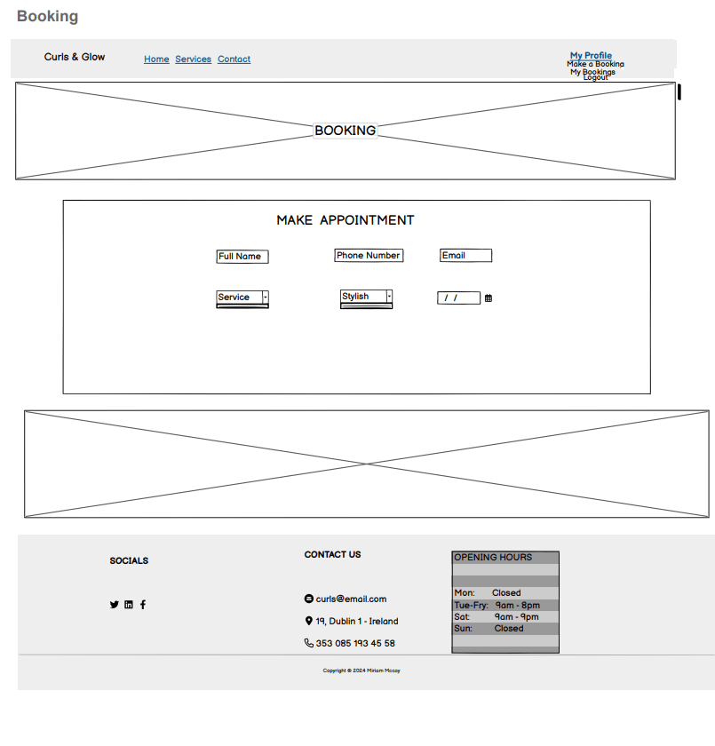
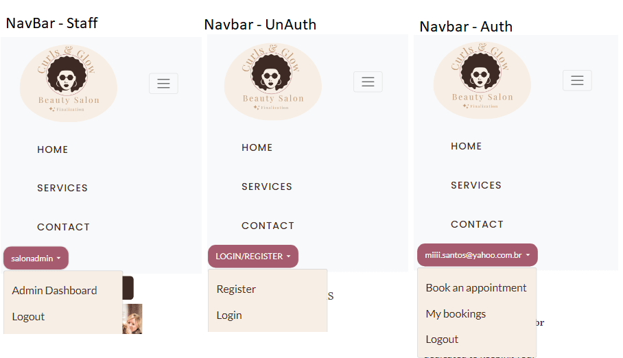

# Curls & Glow

### [Visit the deployed site here](https://curls-and-glow-079ed9c8815e.herokuapp.com/).

Welcome to Curls & Glow, your ultimate destination for personalized haircare services and styling expertise. Our platform connects clients with professional stylists, showcasing a variety of services tailored to enhance and celebrate your natural curls. Explore our user-friendly interface to book appointments, browse through our offerings, and engage with our community of curl enthusiasts. Whether you’re looking for advice, inspiration, or a new look, Curls & Glow has everything you need to embrace your unique beauty.

## User Experience

### User Stories

#### New User
- **US08 - Create user registration page**
  - As a Site User, I can register an account so that I can access the system.

#### Existing User
- **US07 - Implement login and logout system**
  - As a Site User, I can securely log in and out so that I can access personalized features.

- **US10 - Create booking list page**
  - As a Site User, I want to create appointments to book services so that I can schedule my desired services at a convenient time and manage my appointments effectively.

- **US09 - Implement Service Management Features**
  - As a Site Admin, I need the services page and admin panel to be visually appealing and functional so that users can view and book services, and I can manage these services effectively.

- **US13 - Create user profile page**
  - As a Site User, I can view and edit my personal information on the profile page so that my account details are up-to-date.

- **US16 - Add feedback system**
  - As a Site User, I can provide feedback on services I've used so that I can help improve the system and share my experience.

- **US17 - Create section to display stylists**(+ New User)
  - As a Site User, I can see a list of stylists with their biographies and photos so that I can choose a professional based on their profiles.

#### Website Owner/Developer
- **US01 - Set up development environment**
  - As a developer, I can set up the development environment so that I can start the project without interruptions due to configuration issues.

- **US02 - Set up GitHub repository**
  - As a developer, I can set up a GitHub repository so that the source code is managed properly.

- **US03 - Create superuser model**
  - As a site admin, I can create a superuser account so that I have administrative access to manage the system.

- **US04 - Set up Django with basic models**
  - As a developer, I can establish the basic structure in Django so that the application has a solid foundation.

- **US05 - Implement responsive design with Bootstrap**
  - As a Site User, I can view a responsive website so that I have a seamless experience across devices.

- **US06 - Choose typography and color scheme**
  - As a Developer/Designer, I can define the typography and color scheme so that the site’s visual identity is consistent.

- **US11 - Manage Appointments**
  - As a Site Admin, I need to manage appointments by updating their status so that I can ensure the scheduling system operates smoothly.

- **US19 - Conduct final system testing**
  - As a Developer/QA, I can conduct final testing to ensure the system is free of critical errors so that it is reliable and functions as expected.

- **US20 - Create Comprehensive README Documentation**
  - As a Developer, I can create a detailed README file so that the system is well-documented, making it easier for future developers and users to understand, maintain, and use the system. 
- **US21 - Final fixes and adjustments**
  - As a Developer, I can fix and adjust final issues to ensure the quality of the application so that the system is ready for deployment.
- **US22 - Finalize Deployment to Production Environment on Heroku**
  - As a Developer, I can finalize the deployment of the system to the production environment on Heroku so that it is fully accessible to users and operates smoothly in a live setting.

- **US23 - Gather user feedback post-launch**
  - As a Developer, I can gather user feedback post-launch so that I can inform future updates and improvements.

#### Additional Features
- **US18 - Add contact form to services page**
  - As a Site Admin, I want to have all messages saved in the admin interface for control, so that I can manage inquiries effectively.
  - As a Site Staff, I want to view, delete, update the status, and reply to messages through a dedicated interface, so that I can manage communications efficiently.
  - As a Site User, I want to fill out a form to leave a message about the service, so that my inquiries or comments are sent to the administration.

## Site Goals

- Provide a seamless and personalized haircare experience tailored to curly hair.
- Create an intuitive platform where users can easily book appointments with professional stylists.
- Foster a user-friendly environment with a clear, responsive design that ensures accessibility across devices.
- Offer detailed information about available services, stylists, and ongoing promotions to keep users engaged and informed.
- Encourage client feedback to continually improve the platform and services provided.
- Establish a secure, reliable platform with continuous monitoring to ensure smooth operations.
- Empower users to explore different haircare options and receive expert advice for their specific needs.
- Build a community where clients can share their experiences, discover new styles, and connect with stylists who specialize in curls.

## Scope

The project's scope is to create and maintain "Curls & Glow," an online platform dedicated to personalized haircare services and styling expertise. Curls & Glow will serve as a user-friendly and responsive space for individuals to book appointments, browse through services, and engage with a community of curl enthusiasts. Development will be assisted by following a number of EPIC stories which will focus on different aspects of the site. The platform will encompass the following key features:

### [EPIC - Initial Set Up](https://github.com/miriamdosantos/curls-and-glow/milestone/1)
- Developers can set up a new Django project to create the project's structure.
- Database and media storage will be connected to ensure data storage and retrieval for user information and service details.
- An early deployment of the application will be carried out to confirm the initial setup's functionality and provide a basis for further development.

### [EPIC - Initial Design and Authentication System](https://github.com/miriamdosantos/curls-and-glow/milestone/2)
- A responsive user experience will be implemented, defining the visual identity of the site.
- The authentication system will be created, allowing users to register, log in, and manage their profiles.
- Key design components, such as navigation, layout, and branding elements, will be established.

### [EPIC - Scheduling System and Main Page Design](https://github.com/miriamdosantos/curls-and-glow/milestone/3)
- A scheduling system will be developed to enable users to book and manage appointments.
- The main page design will be enhanced with service listings, promotional sections, and user-friendly navigation.
- Service management features, such as booking confirmation and appointment reminders, will be included.

### [EPIC - Advanced Features and Finalization of Design](https://github.com/miriamdosantos/curls-and-glow/milestone/4)
- Advanced features will be added, such as user feedback and stylist profiles.
- A section to display stylists, including their biographies and photos, will be created to help users choose professionals based on their profiles.
- The design of the platform will be finalized to ensure a cohesive and visually appealing experience.

### [EPIC - Testing and Documentation](https://github.com/miriamdosantos/curls-and-glow/milestone/5)
- Final testing will be conducted to ensure the system functions without critical errors and is reliable for users.
- Comprehensive README documentation will be created, including details such as installation instructions, usage guides, and deployment information.
- Final fixes and adjustments will be applied based on test results, ensuring the quality of the application before deployment.

### [EPIC - Deployment and Monitoring](https://github.com/miriamdosantos/curls-and-glow/milestone/6)
- The system will be deployed to the production environment on Heroku, ensuring it is fully accessible to users.
- Secure configurations, such as environment variables and database connections, will be implemented.
- Monitoring and logging mechanisms will be set up to ensure smooth operation, and rollback procedures will be in place for any critical issues post-launch.
- User feedback post-launch will be gathered and analyzed to inform future improvements.

## Design

The primary design goal of *Curls and Glow* was to create a smooth and welcoming user experience focused on simplicity and ease of navigation. The platform was designed to cater to clients looking for curly haircare services while providing them with an intuitive and aesthetically pleasing interface.

A key objective of the design was to ensure users could easily access essential services, book appointments, and explore stylists' profiles without encountering unnecessary complexity. The homepage presents a clean, responsive layout, highlighting important sections such as services, stylists, and testimonials, while maintaining a balanced visual hierarchy.

### Focus on User-Centric Design

Was designed the platform to be user-centric, ensuring that users could navigate easily between the main services and their accounts, regardless of whether they were booking an appointment or browsing available haircare options. The emphasis was placed on minimal page transitions, allowing users to accomplish their tasks without excessive steps. This focus helped create a smooth, engaging user journey.

### Efficient Booking System

To streamline the booking process, the design includes simple but clear call-to-action buttons, allowing users to book appointments without difficulty. A significant aspect of this design involved the appointment confirmation modals, which are reusable and provide users with clear feedback before finalizing their actions.

### Comprehensive Profile and Service Pages

Profile and service pages were designed with user-friendliness in mind. Users can update their profiles, view their booking history, and explore services in one place, avoiding the need for additional navigation. The stylist profiles provide users with quick access to detailed information and visual examples of their work.

### Visual Consistency

To enhance the overall experience, the design emphasizes consistency in colors, typography, and layout. Colors that evoke warmth and trust were chosen, creating a professional yet inviting atmosphere. The use of images throughout the site, especially in sections like the service gallery and testimonials, further enhances the user experience by showcasing the salon’s work in a visually compelling way.

### Mobile Responsiveness

Ensuring that the platform works seamlessly across devices was a critical aspect of the design. All layouts and components were carefully crafted to adapt to various screen sizes, providing mobile users with the same high-quality experience as desktop users.

The design of *Curls and Glow* aimed to combine functionality with aesthetics, ensuring that users not only enjoyed their experience but also found it efficient and easy to navigate, regardless of the device they were using. This commitment to intuitive and responsive design helped solidify the platform as a go-to place for personalized curly haircare services.

### Logo Design and Colour Scheme

The website embraces a warm and inviting color scheme, designed to reflect the salon's focus on natural beauty and haircare. The palette consists of soft tones of browns and earthy shades, combined with elegant whites and neutral colors to convey a sense of relaxation and professionalism. This choice of colors creates an overall calming ambiance, making users feel welcomed and comfortable while navigating through the website.

### Color Palette

- **Primary Color (Rose Gold)**: 
  - **Hex:** `#b76e79`
  - **Usage**: Highlights in the logo, particularly for curls, establishing a luxurious identity.
  
- **Secondary Color (Dark Brown)**:
  - **Hex:** `#3e2a25`
  - **Usage**: Text elements like "Curls & Glow" and "Beauty Salon," as well as borders and outlines, reinforcing brand recognition.

- **Accent Colors**:
  - **Light Cream**: 
    - **Hex:** `#f7efe5`
    - **Usage**: Primary background color providing soft contrast.
  - **Warm Beige**:
    - **Hex:** `#e5d3c3`
    - **Usage**: Subtle highlights and secondary design elements.
  - **Soft Bronze**: 
    - **Hex:** `#c69c7b`
    - **Usage**: Decorative details like stars around the logo, adding elegance.
  - **White**: 
    - **Hex:** `#ffffff`
    - **Usage**: Text and critical UI elements for clarity on darker backgrounds.

### Design Aesthetic

This color scheme not only establishes a professional and luxurious look but also enhances user experience. The combination of rose gold with earthy tones like dark browns and creams offers a modern feel, aligning seamlessly with the *Curls & Glow* brand identity. 

Light shades combined with earthy accents guide user attention toward essential sections without overwhelming them, promoting a clean and polished interface. The elegant logo design, featuring these earthy tones, creates visual harmony and embodies the essence of *Curls and Glow*, reflecting its commitment to personalized and natural curly haircare.

These color combinations help reinforce the salon’s brand identity, providing users with a cozy, professional, and clean interface that encourages exploration. Light shades paired with earthy accents are used to highlight essential sections and direct attention without overwhelming the user.

The overall aesthetic is further enhanced by the simple, yet elegant, logo design, which incorporates these earthy tones, creating visual harmony throughout the platform. The logo embodies the essence of *Curls and Glow*, reflecting the brand's commitment to personalized and natural curly haircare.

### Fonts
The main fonts used in this project is Playfair Display SC and Poppins , which compliments the techical design of the website.

## Database Schema

### Models

#### Allauth User Model
The User model is a crucial component of Django Allauth, featuring standard fields for user authentication, including username, email, password, and more. This model is designed for managing user access and should not be altered directly. It works in tandem with the Profile model to handle user-specific data.

#### UserProfile Model
The UserProfile model represents each user’s presence on the platform, capturing essential details such as their username, email, password, phone number, and membership status (whether they are staff, active, or a superuser).

#### Service Model
The Service model defines the different services offered by the salon, including their titles, descriptions, prices, and durations.

#### Stylish Model
The Stylish model represents the salon's stylists, detailing their names, bios, and photos. This helps clients learn more about the stylists available for their appointments.

#### Availability Model
The Availability model outlines the days and times when each stylist is available for appointments, ensuring clients can book at convenient times.

#### Stylish_Availability Model
The Stylish_Availability model serves as an intermediary table that links stylists to their availability. This is crucial for managing many-to-many relationships between stylists and the times they are available for appointments.

#### Booking Model
The Booking model captures the details of customer appointments, linking user profiles, services, stylists, availability, and any applicable offers.

#### Offer Model
The Offer model details promotional offers available to customers, including discount percentages and validity dates, which helps clients save on services.

#### Testimonial Model
The Testimonial model records customer feedback associated with their bookings, capturing ratings and messages that provide insights into customer satisfaction.

#### ContactMessage Model
The ContactMessage model allows users to send messages to the salon, capturing their names, emails, subjects, and messages to facilitate communication.

### Relationships Explained

- **Stylists and Availability**: Each stylist can have multiple available time slots. The Stylish_Availability table links stylists with their corresponding availability, ensuring clients can easily find when a stylist is free for an appointment.

- **Bookings**:The Booking model serves as a central point, connecting a user’s profile (UserProfile), the service they want, the stylist they choose, the availability they select, and any special offers available at the time. This relationship ensures that all necessary information for an appointment is captured in one place.

- **Testimonials**:Each testimonial is linked to a specific booking, providing valuable feedback on the stylist and service received. This relationship helps maintain a record of customer satisfaction for future reference.

- **Contact Messages**:The ContactMessage model connects user inquiries to their profiles, facilitating effective communication between the salon and its customers. This allows the salon to respond to inquiries with the relevant user context.

Using Inline Admin in Django enhances the organization of related data. For instance, when managing the `UserProfile` in the Django Admin, you can include inlines for `Bookings` and `ContactMessages`. This means that when you view a user's profile, you can also see all their bookings and messages directly on the same page.

#### Benefits of Using Inline Admin
- **Improved Usability**: Inline forms allow administrators to edit related objects without navigating away from the parent object’s page. This streamlines the management process and saves time.
- **Enhanced Context**: Having bookings and messages associated directly with the user profile provides valuable context for administrators, making it easier to understand a user’s interactions with the salon.
- **Cohesive Data Management**: By consolidating information in one view, it reduces the need for cross-referencing different sections of the admin interface, leading to a more efficient workflow.

### Additional Notes
The Stylish_Availability table is automatically created by Django to handle the many-to-many relationship between stylists and their availability times. The UserProfile model is derived from the implementation of Django Allauth’s user model signals, emphasizing its importance in managing user-specific interactions and data.

## Wiframes

The project's main pages and layouts were initially created using the Balsamiqi framework, focusing on the desktop version. The implementation took responsiveness into account, utilizing Bootstrap to adapt the design for mobile versions. This ensures a consistent user experience across different devices, allowing all interface elements to adjust fluidly to various screen widths.

➡️Home

➡️ Services

➡️ Contact

➡️ Booking

➡️ Login

➡️ Register

## Agile Methodology

### Overview

This project was developed following agile principles. Employing the agile methodology enabled me to meticulously map out the website's features by crafting user stories, each of which came with defined acceptance criteria and tasks. Grouping each of these stories into EPIC milestones that's represents the real Sprints of the envirolment work; fooliwing the application to develop the project with the period beetween 1 or 2 week, and give it to the user stories the label and points to complete it . These elements served to distinctly delineate the necessary prerequisites for the successful implementation of each feature.

### SPRINTS/EPICS - Milestones

Within the Agile methodology framework, user stories are organized into  EPICS or Milestones. Additionally, there is also additional Milestones known as Error Handling that was created for the sole purpose of handling any errors that came up during testing, development or tweaking site elements with more refactored coded or enchancements.

➡️ Sprints/Milestone

### User Stories - Issues
The user story issue format consists of the user story itself, as well as acceptance criteria and tasks that outline the essential steps for addressing the issue. Each user story is assigned points based on its complexity, following Agile methodology. This point system helps prioritize tasks and manage project timelines more efficiently.

When possible, during the development process, commit messages are associated with their corresponding issues. This practice ensures the relevance of each commit and also provides a visual representation of the progress made on each project issue. These issues are monitored using milestones, Kanban boards, and other Agile tools.

➡️ User Story Model

### MoSCoW Prioritization
The project employed the "MoSCoW" technique to effectively categorize and prioritize its features and requirements based on their importance. "MoSCoW" stands for "Must have, Should have, Could have, and Won't have," with each category contributing to the organization and prioritization of features. This approach acts as a guiding principle for the development process, ensuring that the most crucial elements are addressed as a top priority.

➡️ User Story Label

### GitHub Projects/Kanban
The project adopted a basic Kanban Board structure, which was divided into columns such as Todo, In Progress, Project Backlog and Done. This setup provided a clear and organized way to track the progress of tasks, making it easier to visualize and manage the workflow throughout the development process. The GitHub project Kanban was linked to the repo for consistant reference.

➡️ Kaban Culrs and Glow - Board

## Features

### Navigation Header
The navigation bar is a consistent element across all pages, designed using Bootstrap and optimized for full responsiveness. The layout is divided into two main sections:

- **Left Section**: This section contains links to key pages such as Home, Services, and Contact, allowing users to easily navigate the website content.
  
- **Right Section**: This part of the navigation bar is related to user authentication:
  - **Authenticated Users**: If a user is logged in, they will see a dropdown with their username. Within this dropdown, they can access options such as booking an appointment, viewing their bookings, or, if they are an admin, navigating to the admin dashboard.
  - **Unauthenticated Users**: If a user is not logged in, they will see a "Login/Register" button that drops down options for either signing up or logging in.

Key aspects:
- The navbar is sticky at the top, ensuring that it remains visible while users scroll through the content.
- It uses the `navbar-toggler` for responsive handling on smaller screens, allowing the menu to collapse into a hamburger button.
- Authentication options are dynamically displayed based on the user's login status, providing a more personalized experience.

This design enhances user experience by ensuring smooth navigation and quick access to important functionalities based on the user's authentication state.

The mobile version of the navbar has all the content rendered when a hamburger icon is clicked. When clicked a dropdown display is rendered showing all navigation links.

➡️ Mobile

➡️ Desktop

### Footer
The footer is a key element that provides users with easy access to social media links, contact information, and business hours. It is styled using Bootstrap and is fully responsive across different screen sizes. The layout consists of three main sections:

- **Social Media Links**: Located on the left side of the footer, this section allows users to easily follow the business on major social platforms such as Twitter, Facebook, and Instagram. Each icon includes a corresponding link that opens the social media page in a new tab, ensuring users remain on the website.
  
- **Contact Information**: The middle section provides users with key contact details, including the business address, email, and phone number. Each piece of information is accompanied by an icon (home, envelope, phone), improving the visual clarity of the section.

- **Opening Hours**: On the right side, users can find the business's opening hours, presented in a clear and structured table. This helps visitors quickly check availability.

The footer is designed to be fully responsive, ensuring it looks great on both desktop and mobile devices. It adapts seamlessly across various screen sizes to maintain a clean and accessible layout.

At the bottom, there’s a copyright notice to acknowledge ownership, styled in a soft brown color (`#c69c7b`) to align with the overall branding.

**Technologies Used**:
- **Bootstrap**: For layout structure and responsiveness.
- **Font Awesome**: For the social media and contact icons.
- **JavaScript Libraries**: Integrated for interactive components  Bootstrap bundle.

➡️ Footer

### Home Page

The **Home Page** of the **Curls & Glow** website is designed to provide a personalized and visually appealing experience, utilizing modern and responsive components.

#### Key Features

- **Personalized Message**:
  - Displays a dynamic greeting for authenticated users with their name and a direct link to manage bookings.
  - For visitors, it shows a welcoming message with a button to explore services.

- **Image Carousel**:
  - Features three rotating banners, each with images and captions that highlight the mission and services of Curls & Glow.

- **Offers Section**:
  - Displays current promotions, including title, description, discount percentage, promo code, and expiration date.

- **Services Section**:
  - Showcases available services with images, titles, and a brief description for each one.

- **Stylists Section**:
  - Highlights the salon's stylists with photos, names, and a dropdown to view each stylist's bio.

- **Testimonials Section**:
  - Displays client testimonials with reviews, ratings, and client photos, using a carousel layout.

➡️ Home 

### Services Page
The **Services Page** is designed to provide users with detailed information on the salon's offerings and help them book appointments quickly.

#### Key Features:

- **Video Highlight**:
  - The page features a muted, looping background video at the top, showcasing Curls & Glow's expertise in personalized curl haircare.

- **Service Listings**:
  - The services are displayed in a responsive card layout, dynamically populated from the database. Each card includes:
    - Service title, price, and description.
    - An icon representing the type of service.
    - The duration of the service.

- **Appointment Booking**:
  - If the user is authenticated, a button to book an appointment is displayed, linking directly to the booking page.
  - For unauthenticated users, a modal pops up prompting them to log in or register before booking an appointment.

- **Gallery**:
  - A visually engaging gallery showcases various curl styles, providing inspiration to potential clients.
  - The gallery is responsive and adapts well to different screen sizes using Bootstrap's grid system.

- **Modal for Authentication**:
  - A modal window is used to notify unauthenticated users to either log in or sign up to book an appointment. The modal contains links to both actions and ensures a smooth user experience.

➡️ Services 

### Contact Page

The **Contact Page** allows users to reach out to the Curls & Glow team by submitting a contact form. This page is designed to ensure a smooth user experience while maintaining a consistent layout with the rest of the site. The following technical details describe the structure and features of the Contact Page:

#### Features

- **Hero Section**: The page begins with a visually appealing hero section that welcomes users with a catchy heading and informative text encouraging them to get in touch with the salon.
  
- **Contact Form**: 
  - The form is rendered using Django's **crispy forms**, which simplifies the form layout and ensures it is styled according to Bootstrap's grid system.
  - It includes built-in CSRF protection with `` for security.
  - Users are prompted to fill out their details and submit any inquiries, which are processed on the backend.

- **Form Validation and Submission**:
  - The form handles validation and provides user feedback upon submission using Django messages.
  - If there are errors during form submission, the page will display the appropriate error messages.

- **Responsive Layout**: 
  - The page is built using Bootstrap’s grid system to ensure responsiveness across different device sizes.
  - It adapts seamlessly from mobile screens to larger desktop views, providing an optimal user experience.

### Technical Stack
  
- **Bootstrap 5**: Leveraged for responsive design and to maintain consistent styling throughout the page, especially for the grid system and form layout.
  
- **Django Crispy Forms**: Used to simplify form rendering and improve visual consistency without manually managing form fields.

- **Security**: Ensured through CSRF token usage, which protects the form against cross-site request forgery.

➡️ Contact 

### Admin Dashboard Features (Contact Message Management)

The admin dashboard for managing contact messages offers staff users the ability to:

- **View Messages:** A responsive message inbox where staff can see the name, subject, and email of each message. It uses a table layout for larger screens and a card layout for smaller screens, ensuring a user-friendly experience across devices.
  
- **Respond to Messages:** A dedicated interface allows staff to reply directly to contact messages. The form automatically fills in the contact’s email and original message, making it easy to write responses.
  
- **Mark as Read:** Staff can update the status of a message to "Read" using the action button.
  
- **Delete Messages:** Staff can remove messages with a simple confirmation prompt to avoid accidental deletions.

## Technical Details

- The inbox is built using Bootstrap’s grid system for responsiveness, with conditional display rules (`d-none d-md-table` and `d-md-none`) to toggle between table and card layouts.
  
- The response form leverages Formspree for handling email replies securely and without additional backend configurations.
  
- The system supports actions such as replying, marking as read, and deleting, using URL patterns tied to the message’s ID, with basic JavaScript confirmation for deletions.

This system enables efficient communication management, ensuring that customer inquiries are promptly addressed.

➡️ Contact 

### Booking Page

The booking page allows users to schedule appointments with hair specialists through a user-friendly interface. Key features include:

- **Hero Section:** Displays the booking title prominently against a background image, providing a welcoming entry point for users.
  
- **Appointment Form:** Users can select a hair specialist and choose a date for their appointment. The form includes:
  - **Stylist Selection:** Displays available stylists with images, allowing users to select their preferred stylist. An option to choose "None" is also provided.
  - **Date Picker:** Users can select a date using a date input field, ensuring an easy and intuitive booking process.
  - **Submit Button:** A clear and accessible button that submits the selected stylist and date.

- **Stylist Availability Section:** Displays the work days of each stylist, helping users understand when their preferred stylist is available.

#### Technical Details

- The page utilizes Bootstrap for responsive design, ensuring a seamless experience across devices.
  
- The form submission is handled via a POST request to the `select_date` URL, which processes the user's selection and directs them to the next steps in the booking process.

This feature-rich booking page enhances user experience by simplifying appointment scheduling and providing clear information about stylist availability.

➡️ Booking 

#### Booking System Overview

The booking system allows users to select a stylist, choose a date, and book an appointment seamlessly.

### Booking Flow
1. **Select Stylist and Date**: Users select a stylist and a date from the booking page. After submission, they are redirected to the **Select Time** page.
2. **Select Time**: Users can choose from available time slots for their appointment. They will also enter their full name, email, and select a service. An optional coupon code can be entered here as well.
3. **Form Submission**: Upon clicking the **Book** button, the form data is sent to the server for processing.

#### Template Structure
- **Booking Template (`booking.html`)**: This template handles the initial selection of stylist and date.
- **Select Time Template (`select_time.html`)**: This template displays the available times based on the selected stylist and date. It includes fields for user details and an optional coupon code.

#### Features
- **Form Validation**: All fields are validated to ensure required information is provided.
- **Modal for Invalid Coupons**: If the user enters an invalid or expired coupon code, a modal will inform them of the error and prompt for re-entry.

➡️ Select Time 

#### Booking Confirmation 

The Booking Confirmation Page is part of the Booking flow as well,  is responsible for displaying the confirmation of a user's booking. It shows essential appointment details such as:

- **Booking Name**: The name of the user who made the booking.
- **Email Address**: The email provided during the booking process.
- **Date and Time**: The selected date and time for the appointment.
- **Service**: The type of service booked.
- **Stylist**: The stylist assigned to the booking.
- **Offer**: Any promotional offer applied (if available).

### Key Features:
- Utilizes Bootstrap for responsive design.
- Conditionally displays the offer section if applicable.
- Provides a clear call-to-action button for managing bookings.

➡️ Booking Confirmation 

### My Bookings Page

The  My Bookings page is designed to display a user's bookings, allowing them to manage their appointments effectively. It provides an overview of all the services they have scheduled, along with options for editing, deleting, and leaving testimonials for completed bookings.

## Key Features:
- **User Greeting**: Displays a personalized greeting to the logged-in user, encouraging them to check their appointments.
- **Booking List**: Shows a responsive grid of cards, each representing a user's booking, with details including:
  - **Service**: The name of the service booked.
  - **Date and Time**: The scheduled date and time of the appointment.
  - **Stylist**: The stylist assigned to the booking.
- **Action Buttons**: Provides buttons for each booking to:
  - **Edit**: Allows users to modify their booking details.
  - **Delete**: Enables users to remove their bookings.
  - **Leave Testimonial**: Offers the option to leave feedback for completed bookings (disabled for upcoming appointments).
- **No Bookings Message**: Displays a message encouraging users to make their first booking if no appointments are found.

## Usage
The template leverages Bootstrap for responsive design and includes conditional logic to handle the display of bookings and actions based on their status.

➡️ My bookings 

#### Leave a Testimonial
The Leave a Testimonial page is designed for users to submit their feedback after an appointment. This feedback is crucial for improving services and helps potential clients make informed decisions.

##### Key Features:
- Provides a user-friendly interface for submitting testimonials.
- Utilizes Bootstrap for responsive design and styling.
- Includes a CSRF token for security against cross-site request forgery.
- The form is rendered using the Crispy Forms library to ensure a clean and consistent layout.

##### Important Notes:
- Ensure that the admin changes the booking status to "Completed" before the user can access this testimonial page.
- After user submit the testimonial button will be change disable and informative `Testimonial Submitted `
- User testimonials are valuable for service improvement and can influence new clients.

➡️ Leave Testimonial 

#### Delete Booking Confirmation

The Delete Confirmg page provides the user with a confirmation prompt before permanently canceling a booking. This ensures that users are fully aware of the action they are about to perform and helps prevent accidental deletions.

##### Key Features:
- **Booking Details**: The template displays essential information about the booking, such as:
  - **Service**: The type of service booked.
  - **Stylist**: The stylist assigned to the appointment.
  - **Date and Time**: The scheduled date and time for the booking.
  
- **Form Submission**: The form is submitted via `POST` to ensure security, and the CSRF token is included to protect against cross-site request forgery.
- **Action Buttons**:
  - **Delete**: A prominent, red button to confirm the cancellation.
  - **Cancel**: A secondary button allowing the user to back out of the deletion process and return to their bookings.

➡️ Leave Testimonial 

#### Edit Booking
The Edit Booking page  is responsible for providing users with an interface to modify an existing booking. Users can update their service, stylist, or booking time.

##### Key Features:
- **Form Layout**: The form is rendered using the `crispy_forms` tag, ensuring a well-structured and consistent layout that adheres to Bootstrap styles.
- **CSRF Protection**: The form includes a CSRF token to protect against cross-site request forgery.
- **Responsive Design**: The form layout is fully responsive and adapts to different screen sizes using the Bootstrap grid system.
  
##### Action Buttons:
- **Save Changes**: A prominent, blue button (`btn-primary`) to submit the form and update the booking.
- **Cancel**: A secondary, grey button (`btn-secondary`) that allows the user to cancel the edit and return to the "My Bookings" page without saving any changes.

➡️ Leave Testimonial 

