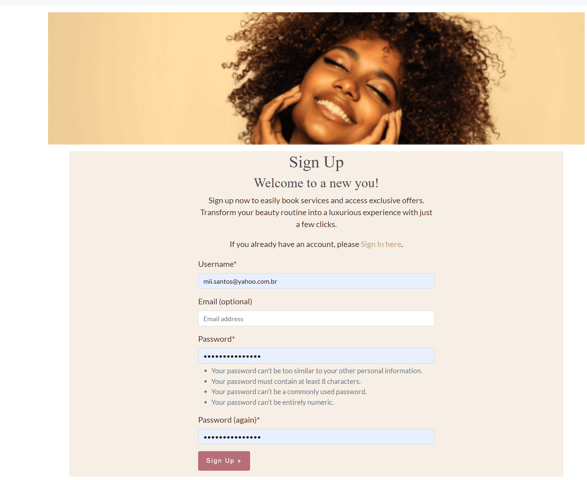

# Table of Contents
- [User Story Testing](#user-story-testing)
- [Code Validation](#code-validation)
 - [HTML](#html)
 - [CSS](#css)
 - [JavaScript](#javascript)
    - [Modal Management](#modal-management)
    - [Scroll Animations](#scroll-animations)
    - [Bootstrap Carousel](#bootstrap-carousel)
    - [Alert Notifications](#alert-notifications)

## User Story Testing

| **User Story** | **Screenshot** | **Result** |
|----------------|----------------|------------|
| As a developer, I can set up the development environment so that I can start the project without interruptions due to configuration issues. | <details><summary>View Screenshot</summary>The project was set up successfully.</details> | ✅ Success |
| As a developer, I can set up a GitHub repository so that the source code is managed properly. | <details><summary>View Screenshot</summary>The GitHub repository was set up successfully.</details> | ✅ Success |
| As a Site Admin, I can create a superuser account so that I have administrative access to manage the system. | <details><summary>View Screenshot</summary>Admin interface showing the creation of a superuser account with username, email, and password fields.</details> | ✅ Success |
| As a Developer, I can establish the basic structure in Django so that the application has a solid foundation. | <details><summary>View Screenshot</summary>Database set up successfully.</details> | ✅ Success |
| As a Site User, I can view a responsive website so that I have a seamless experience across devices. | <details><summary>View Screenshot</summary></details> | ✅ Success |
| As a Developer/Designer, I can define the typography and color scheme so that the site’s visual identity is consistent. | <details><summary>View Screenshot</summary>A color theme was chosen for the website as referenced in the [README](https://github.com/miriamdosantos/curls-and-glow?tab=readme-ov-file#logo-design-and-colour-scheme).</details> | ✅ Success |
| As a Site User, I can securely log in and out so that I can access personalized features. | <details><summary>View Screenshot</summary></details> | ✅ Success |
| As a Site User, I can register an account so that I can access the system. | <details><summary>View Screenshot</summary></details> | ✅ Success |
| As a Site Admin, I need the services page and admin panel to be visually appealing and functional so that users can view and book services, and I can manage these services effectively. | <details><summary>View Screenshot</summary></details> | ✅ Success |
| As a Site User,I want to create appointments to book services, So that I can schedule my desired services at a convenient time and manage my appointments effectively. | <details><summary>View Screenshot</summary></details> | ✅ Success |
| As a Site User,I want to create appointments to book services, So that I can schedule my desired services at a convenient time and manage my appointments effectively. |<details><summary>View Screenshot</summary> Implemented the logic within Database Setup - Admin Django Interface </details> | ✅ Success |
| As a Site User I can provide feedback on services I've been done so that I help improve the system and share my experience. | <details><summary>View Screenshot</summary></details> | ✅ Success |
| As a Site User I can see a list of stylists with their biographies and photos so that  I can choose a professional based on their profiles. | <details><summary>View Screenshot</summary></details> | ✅ Success |
| As a Site Admin,I want to have all messages saved in the admin interface for control,So that I can manage inquiries effectively. | <details><summary>View Screenshot</summary></details> | ✅ Success |
| As a Site Staff, I want to view, delete, update the status, and reply to messages through a dedicated interface, So that I can manage communications efficiently. / As a Site Staff, I want to view, delete, update the status, and reply to messages through a dedicated interface, So that I can manage communications efficiently.  | <details><summary>View Screenshot</summary></details> | ✅ Success | 
| As a Site User, I want to fill out a form to leave a message about the service, So that my inquiries or comments are sent to the administration. | <details><summary>View Screenshot</summary></details> | ✅ Success |
| As a Site User I can see feedback from other users on the homepage so that  can get insights into the quality of services and make informed decisions. | <details><summary>View Screenshot</summary></details> | ✅ Success |
| As a Developer I can create a detailed README file so that the system is well-documented, making it easier for future developers and users to understand, maintain, and use the system. | <details><summary>View Screenshot</summary>[README ](https://github.com/miriamdosantos/curls-and-glow?tab=readme-ov-file#curls--glow)</details> | ✅ Success |
| As a Developer I can fix and adjust final issues to ensure the quality of the application so that that the system is ready for deployment. |<details><summary>View Screenshot</summary>[Curls & Glow ](http://curls-and-glow-079ed9c8815e.herokuapp.com/)</details> | ✅ Success |


## Code Validation
### HTML
All HTML pages were run through the [W3C HTML Validator](https://validator.w3.org/). See results in below table.
| **User Story** | **Screenshot** | **Result** |
|----------------|----------------|------------|
| Home| <details><summary>View Screenshot</summary></details> | ✅ Success |
| Services| <details><summary>View Screenshot</summary></details> | ✅ Success |
| Contact| <details><summary>View Screenshot</summary></details> | ✅ Success |
| Login| <details><summary>View Screenshot</summary></details> | ✅ Success |
| Register| <details><summary>View Screenshot</summary></details> | ✅ Success |
| Logout| <details><summary>View Screenshot</summary></details> | ✅ Success |
| Book an appointment| <details><summary>View Screenshot</summary></details> | ✅ Success |
| My bookings| <details><summary>View Screenshot</summary></details> | ✅ Success |
| My bookings| <details><summary>View Screenshot</summary></details> | ✅ Success |
| Booking Confirmation| <details><summary>View Screenshot</summary></details> | ✅ Success |
| Booking Confirmation| <details><summary>View Screenshot</summary></details> | ✅ Success |
| Edit Booking | <details><summary>View Screenshot</summary></details> | ✅ Success |
| Edit Booking | <details><summary>View Screenshot</summary></details> | ✅ Success |
| Delete Booking | <details><summary>View Screenshot</summary></details> | ✅ Success |
| Leave Testimonial | <details><summary>View Screenshot</summary></details> | ✅ Success |

### CSS
Test Results CSS PASS
<details><summary>View Screenshot</summary></details>

### JavaScript
In this project, I utilized JavaScript to enhance user experience through various interactive features:

- **Modal Management**:
    - Implemented Bootstrap modals to prompt user actions, such as logging in or showing alerts for invalid coupons. Modals are triggered by button clicks and automatically close with appropriate event listeners.
- **Scroll Animations**:
    - Added scroll-triggered animations for elements with the class .block. The handleScroll function detects when elements come into view and applies animations dynamically.
- **Bootstrap Carousel**:
    - Initialized a Bootstrap carousel that cycles through images every three seconds, improving the visual presentation of content.
- **Alert Notifications**:
    - Implemented alerts that automatically close after a specified duration, providing timely feedback to users without manual intervention.

This combination of features improves the overall interactivity and responsiveness of the web application, creating a more engaging user experience.
<details><summary>View Screenshot</summary></details>

### Python

To verify and validate the code, run the following commands in your terminal:

1. Format the code using Black:
   ```bash
   black .
   ```

2. Check for style violations and linting errors with Flake8:
   ```bash
   flake8 .
   ```

#### Test Results
All tests have passed successfully, without a error in the terminal ensuring that the code adheres to the defined standards and is functioning correctly.
<details><summary>View Screenshot</summary></details>

### Responsiveness
Throughout the development process, each page underwent testing using Google Chrome's developer tools. The approach focused on verifying that every page would seamlessly adjust to a variety of screen sizes wider using the boostrap to makes more effetive this process.

### Browser Testing
The Website was tested on Google Chrome, Firefox, Safari and Chrome Canary browsers with no issues noted.

### Device Testing
The website was tested on a variety of devices, including Desktop, Laptop, Huawei P30 Pro, and Samsung tablet, to ensure that it displayed well on screens of different sizes, both in portrait and landscape orientations. The website functioned as expected, and its responsive design was validated using Chrome developer tools on various devices, ensuring that the layout remained structurally sound across different screen dimensions.


#### Manual Test Cases for Curls & Glow

| Test Case ID | Description                                   | Steps to Execute                                                                                               | Expected Result                                                      | Status        |
|---------------|-----------------------------------------------|----------------------------------------------------------------------------------------------------------------|----------------------------------------------------------------------|---------------|
| TC001         | Verify Home Page Loads Successfully           | 1. Open the application URL.<br>2. Check if the home page is displayed correctly.                              | Home page is displayed with all sections visible.                   | Not Tested    |
| TC002         | Check Authentication Redirect                 | 1. Click on 'My Bookings' without being logged in.<br>2. Observe the alert modal.                              | An alert modal prompts to log in or register.                       | Not Tested    |
| TC003         | Test Booking Button for Authenticated User    | 1. Log in to the application.<br>2. Click on 'Book Appointment'.                                               | User is redirected to the booking page.                             | Not Tested    |
| TC004         | Validate Offer Cards Display                  | 1. Open the home page.<br>2. Check for the presence of two offer cards.                                        | Two offer cards are displayed with correct information.             | Not Tested    |
| TC005         | Confirm Carousel Functionality                | 1. Navigate to the home page.<br>2. Interact with the carousel navigation.                                      | Carousel slides through images smoothly without errors.             | Not Tested    |
| TC006         | Check Testimonial Section                     | 1. Scroll to the testimonial section on the home page.<br>2. Verify the display of testimonial cards.          | All testimonial cards display correctly without layout issues.       | Not Tested    |
| TC007         | Ensure Video Section Loads                    | 1. Go to the services page.<br>2. Observe the video section functionality.                                      | Background video plays correctly with text overlay visible.         | Not Tested    |
| TC008         | Verify Image Gallery Display                   | 1. Navigate to the gallery section.<br>2. Check for the presence and layout of images.                          | Gallery displays images in a grid layout as intended.               | Not Tested    |
| TC009         | Validate Responsive Design                    | 1. Resize the browser window.<br>2. Check if all elements adjust according to the screen size.                  | All sections maintain their layout on different screen sizes.       | Not Tested    |
| TC010         | Check User Profile Update                     | 1. Log in to the application.<br>2. Navigate to the profile page and update the profile information.           | Profile information updates successfully and displays the new data. | Not Tested    |

#### Automated Testing - Summary for Curls & Glow Application

#### Overview
This document provides a summary of the test cases implemented for the Curls & Glow application. The tests ensure that the application's views and forms function correctly under various conditions, covering different user types and form validation scenarios. A temporary local database was used for testing purposes, and the URL was reverted to the online version after testing, that each test will be find in each app tests.py file

##### Home View Tests
- **Test Home Page Access**: 
  - Validates that all users (authenticated and unauthenticated) can access the home page.
  
- **Test Authenticated User Redirect**: 
  - Ensures that authenticated users are redirected to the 'My Bookings' page instead of the profile page.

##### Services View Tests
- **Test Services Page Access**: 
  - Verifies that all users can access the services page.
  
- **Test Services Retrieval**: 
  - Checks that the services displayed match the data in the database.

- **Test Service Detail Access**: 
  - Confirms that users can access service detail pages and that the correct service data is shown.

##### Contact View Tests
- **Test Contact Form Submission by Regular User**: 
  - Validates that regular users can submit messages through the contact form.
  
- **Test Contact Form Submission by Visitor**: 
  - Ensures that visitors (non-authenticated users) can also submit messages.
  
- **Test Contact Form Submission with Missing Fields**: 
  - Verifies that the correct error messages are displayed when the contact form is submitted without required fields.
  
- **Test Contact Message Storage**: 
  - Confirms that submitted contact messages are correctly saved in the database.
  
- **Test Contact Message Check All Fields**: 
  - Checks that all required fields return the appropriate error messages when the form is submitted empty.

##### Update Status View Tests
- **Test Update Status by Staff User**: 
  - Validates that staff users can successfully update the status of contact messages.
  
- **Test Update Status by Regular User**: 
  - Ensures that regular users receive a 403 Forbidden status when attempting to access the update status functionality.

##### Delete Message View Tests
- **Test Delete Message by Staff User**: 
  - Confirms that staff users can delete contact messages and that those messages no longer exist in the database after deletion.
  
- **Test Delete Message by Regular User**: 
  - Verifies that regular users cannot delete messages and receive a 403 Forbidden status when attempting to do so.

##### Booking View Tests
- **Test Booking Page Access**: 
  - Validates that all users can access the booking page.
  
- **Test Booking Submission by Authenticated User**: 
  - Checks that authenticated users can successfully submit a booking request.
  
- **Test Booking Submission by Guest User**: 
  - Ensures that guest users receive a prompt to log in when attempting to book an appointment.
  
- **Test Booking Validation**: 
  - Verifies that all required fields in the booking form are validated properly, displaying appropriate error messages when needed.

##### Conclusion
These tests aim to ensure the reliability and functionality of the Curls & Glow application. They cover essential use cases for different user roles and ensure that the application's forms enforce necessary validations.


#### Lighthouse
All the pages attends the good requisist expected.
<details><summary>View Screenshot</summary>

