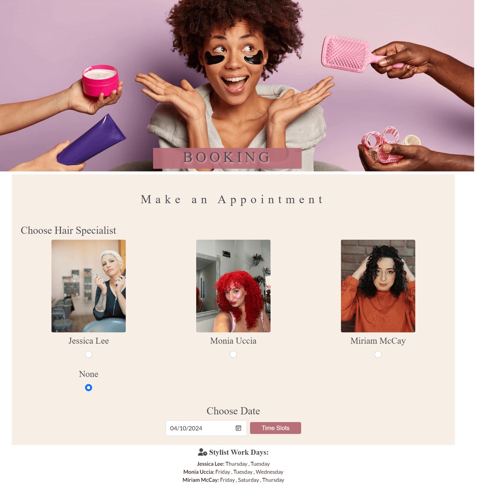
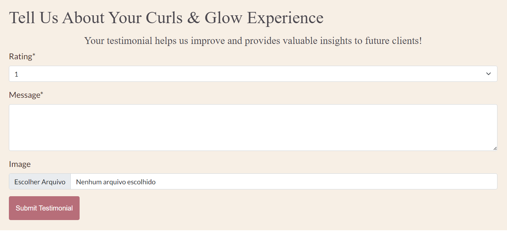

# Table of Contents
## User Story Testing

| **User Story** | **Screenshot** | **Result** |
|----------------|----------------|------------|
| As a developer, I can set up the development environment so that I can start the project without interruptions due to configuration issues. | 

View Screenshot
The project was set up successfully.
 | ✅ Success |
| As a developer, I can set up a GitHub repository so that the source code is managed properly. | 

View Screenshot
The GitHub repository was set up successfully.
 | ✅ Success |
| As a Site Admin, I can create a superuser account so that I have administrative access to manage the system. | 

View Screenshot
Admin interface showing the creation of a superuser account with username, email, and password fields.
 | ✅ Success |
| As a Developer, I can establish the basic structure in Django so that the application has a solid foundation. | 

View Screenshot
Database set up successfully.
 | ✅ Success |
| As a Site User, I can view a responsive website so that I have a seamless experience across devices. | 

View Screenshot

 | ✅ Success |
| As a Developer/Designer, I can define the typography and color scheme so that the site’s visual identity is consistent. | 

View Screenshot
A color theme was chosen for the website as referenced in the [README](https://github.com/miriamdosantos/curls-and-glow?tab=readme-ov-file#logo-design-and-colour-scheme).
 | ✅ Success |
| As a Site User, I can securely log in and out so that I can access personalized features. | 

View Screenshot

 | ✅ Success |
| As a Site User, I can register an account so that I can access the system. | 

View Screenshot

 | ✅ Success |
| As a Site Admin, I need the services page and admin panel to be visually appealing and functional so that users can view and book services, and I can manage these services effectively. | 

View Screenshot

 | ✅ Success |
| As a Site User,I want to create appointments to book services, So that I can schedule my desired services at a convenient time and manage my appointments effectively. | 

View Screenshot

 | ✅ Success |
| As a Site User,I want to create appointments to book services, So that I can schedule my desired services at a convenient time and manage my appointments effectively. | Implemented the logic within Database Setup - Admin Django Interface | ✅ Success |
| As a Site User I can provide feedback on services I've been done so that I help improve the system and share my experience. | 

View Screenshot

 | ✅ Success |
| As a Site User I can see a list of stylists with their biographies and photos so that  I can choose a professional based on their profiles. | 

View Screenshot

 | ✅ Success |
| As a Site Admin,I want to have all messages saved in the admin interface for control,So that I can manage inquiries effectively. | 

View Screenshot

 | ✅ Success |
| As a Site Staff, I want to view, delete, update the status, and reply to messages through a dedicated interface, So that I can manage communications efficiently. / As a Site Staff, I want to view, delete, update the status, and reply to messages through a dedicated interface, So that I can manage communications efficiently.  | 

View Screenshot

 | ✅ Success | 
| As a Site User, I want to fill out a form to leave a message about the service,
So that my inquiries or comments are sent to the administration. | 

View Screenshot

 | ✅ Success |
| As a Site User I can see feedback from other users on the homepage so that  can get insights into the quality of services and make informed decisions. | 

View Screenshot

 | ✅ Success |
| As a Developer I can create a detailed README file so that the system is well-documented, making it easier for future developers and users to understand, maintain, and use the system. | 

View Screenshot
[README ](https://github.com/miriamdosantos/curls-and-glow?tab=readme-ov-file#curls--glow)
 | ✅ Success |
| As a Developer I can fix and adjust final issues to ensure the quality of the application so that that the system is ready for deployment. |

View Screenshot
[Curls & Glow ](http://curls-and-glow-079ed9c8815e.herokuapp.com/)
 | ✅ Success |

